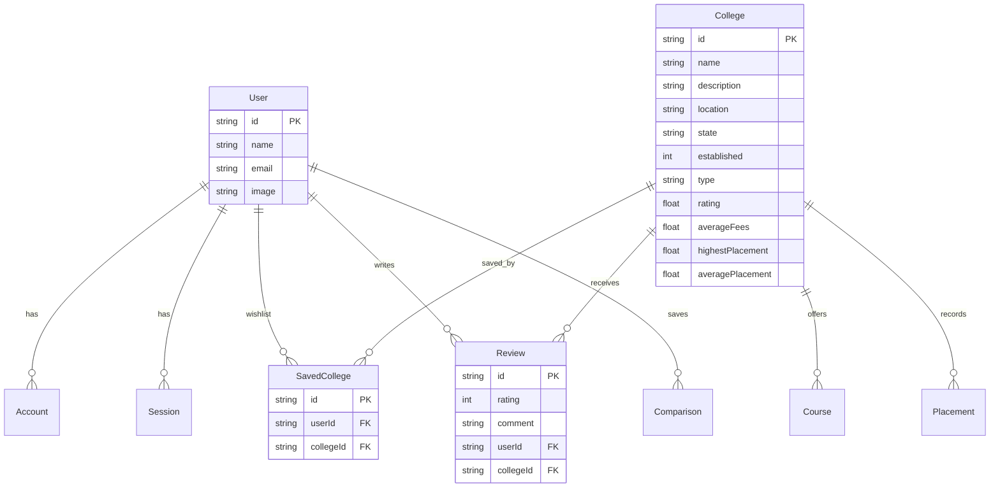

# 🏗️ Architecture Design: CampusCompass AI

This document outlines the system architecture, file structure, database modeling, and technical optimizations integrated into **CampusCompass AI**.

---

## 📁 1. Project Directory Structure

```text
c:\Users\acer\Desktop\CollegeCompass AI\
├── prisma/                     # Database schemas and data generation
│   ├── schema.prisma           # Prisma database schema definition
│   └── seed.ts                 # Full database seed seeder (50+ Indian colleges)
├── public/                     # Static files (logos, illustrations)
├── src/
│   ├── app/                    # Next.js App Router (Layouts & Route Pages)
│   │   ├── api/                # Dynamic Serverless Route Handlers
│   │   │   ├── auth/           # NextAuth Session Controllers
│   │   │   ├── autocomplete/   # Fast autocomplete query endpoint
│   │   │   ├── colleges/       # Colleges listing & detail endpoints
│   │   │   ├── comparisons/    # Comparison storage persistence handlers
│   │   │   ├── reviews/        # Student testimonial submission endpoints
│   │   │   └── saved/          # Saved Wishlist toggle API
│   │   ├── auth/               # Custom sign-in portal UI
│   │   ├── college/            # College detailed profile dynamic views
│   │   ├── compare/            # Side-by-side comparative analytics board
│   │   ├── wishlist/           # User saved dashboard
│   │   ├── globals.css         # CSS Variables and Tailwind configuration
│   │   ├── layout.tsx          # Root Layout (Navbars, Footers, Providers)
│   │   └── page.tsx            # Main listings dashboard page
│   ├── components/             # Reusable Client-Side and Server UI Components
│   │   ├── college-card.tsx    # Listing card component with wishlists
│   │   ├── command-palette.tsx # Ctrl+K command bar
│   │   ├── placement-chart.tsx # SVG chart visualizer (Recharts)
│   │   └── navbar.tsx          # Responsive navbar with theme toggles
│   ├── lib/                    # Shared third-party configurations
│   │   ├── auth.ts             # Auth options configuration (OAuth & Credentials)
│   │   └── prisma.ts           # Unified PrismaClient singleton database connector
│   ├── store/                  # Global lightweight Zustand stores
│   │   ├── comparisonStore.ts  # Comparison queue management (max 3 colleges)
│   │   └── toastStore.ts       # Global toast message broker
│   └── types/                  # Centralized strict typescript definitions
│       └── index.ts            # Domain entity interfaces (User, College, etc.)
├── package.json                # Project configurations & scripts
└── tsconfig.json               # Rigid typescript strict configurations
```

---

## 🗄️ 2. Database Schema Design (Prisma)

CampusCompass AI employs a strongly-typed relational model to map college information, student profiles, and actions:



### Technical Schema Optimizations:
1.  **Composite Unique Indexing**: The `SavedCollege` table applies a composite index `@@unique([userId, collegeId])` to ensure a user cannot save the same university twice, protecting database integrity.
2.  **Referential Cascade Action**: On user or university deletion, related reviews and wishlists are cleaned up using `onDelete: Cascade` rules to avoid orphan relational rows.
3.  **Flexible Schema Types**: Decimal and large values (e.g., historical package LPA or annual fees) are stored as floats or integers for rapid mathematical queries.

---

## ⚡ 3. Unified State Management (Zustand)

Instead of complex React context bundles, the platform utilizes lightweight **Zustand** stores for transient browser state.

### Comparison Queue Store (`src/store/comparisonStore.ts`):
*   Tracks an array of `selectedColleges` currently loaded for side-by-side inspection.
*   **Validation Rule**: Restricts the array to a maximum of 3 colleges, throwing success/error alerts accordingly:
```typescript
addCollege: (college) => {
  if (state.selectedColleges.length >= 3) {
    return { success: false, message: "Maximum 3 colleges can be compared" };
  }
  ...
}
```

### Toast Notification Store (`src/store/toastStore.ts`):
*   Manages a dynamic queue of notifications.
*   Dispatches success, info, and error alerts across the screen, automatically wiping them out after 4000ms.

---

## 🛡️ 4. Server-Client Boundaries & Optimizations

Next.js 15 App Router handles data loading efficiently by optimizing the boundary between Server Components and Client Components.

1.  **Static Listings Pre-Rendering**: The main `/` route compiles as a static site, caching the core layout skeleton and page shell.
2.  **Dynamic Client-Side Search**: Facet changes and pagination calls trigger fast, client-side React Query requests directly calling dynamic Serverless API endpoints.
3.  **Hydration Guarding**: Dynamic components that read local storage or perform browser layout (like the SVG charts and theme loaders) use mount-guards:
```typescript
const [isMounted, setIsMounted] = useState(false);
useEffect(() => {
  setIsMounted(true);
}, []);

if (!isMounted) return <SkeletonLoader />;
```
4.  **No-Effect State Initialization**: The application theme is loaded directly in the initial state parameter inside `navbar.tsx`, preventing cascading rendering steps during mount.
