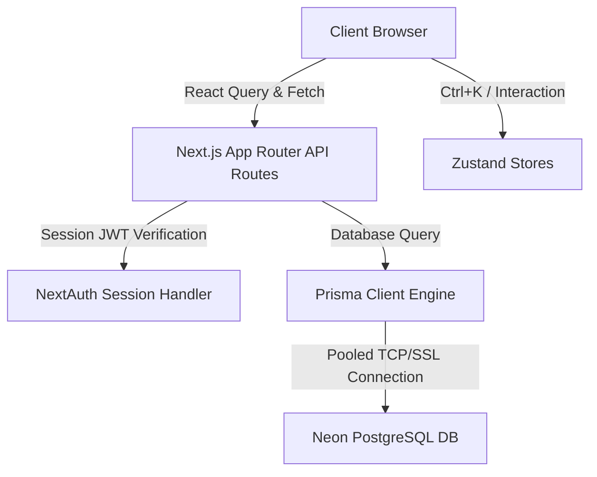

# 🧭 CampusCompass AI

[](https://nextjs.org/)
[](https://www.typescriptlang.org/)
[](https://tailwindcss.com/)
[](https://www.prisma.io/)
[](https://www.postgresql.org/)
[](https://opensource.org/licenses/MIT)

**CampusCompass AI** is a production-grade, highly interactive college discovery and side-by-side comparison platform tailored specifically for Indian higher education candidates. Built with a modern glassmorphic UI, Next.js 15 App Router, React 19, Prisma ORM, and Neon Serverless PostgreSQL, it provides students with authenticated personalized dashboards, advanced multi-facet search engine, comprehensive side-by-side comparison matrix, and validated student review systems.

---

## 📸 Platform Showcase & Demo

### 🎥 Loom Walkthrough
[](https://loom.com/share/placeholder-loom-id)
> *Click the badge above to watch a detailed 3-minute video walkthrough showcasing the application flow, codebase quality, database seeding, and real-time comparative analytics.*

### 🖥️ Interface Previews

| Listing & Search Dashboard | Side-by-Side Comparison Matrix |
| :---: | :---: |
|  |  |
| *Facet filters, smart stream sorting, and real-time search.* | *Interactive metrics comparison for Fees, Ratings, and Placements.* |

| College Dynamic Profile | Interactive Placement Analytics |
| :---: | :---: |
|  |  |
| *Rich dynamic tabs (Overview, Courses, Placement details).* | *Visualized charts highlighting Highest vs. Avg Package trends.* |

---

## ⚡ Core Technical Features

*   🔍 **Facetted Real-Time Search Engine**: Filter over 50+ premium Indian universities by **Annual Fees, Stream, Rating, and Location** with smart debounced search and active filters.
*   📊 **Compare Matrix**: Compare up to 3 colleges concurrently. Visualizes key metrics like **highest placement, average fees, seat intake, student ratings, and facilities** in a beautiful card matrix.
*   📈 **Placement package trends charts**: Integrated responsive SVG-based trend visualizations (using `Recharts`) to trace historical highest packages vs. average placements.
*   🔒 **OAuth 2.0 & Credentials Auth**: Secure sign-in flows powered by **NextAuth.js** supporting Google OAuth providers and traditional secure Credentials strategies.
*   💖 **Wishlist Board**: Save desired colleges to a personalized profile panel that remains persistent in database.
*   💬 **Verified Review Board**: Authenticated dynamic student testimonial submission system with instant overall university rating recalculation on submission.
*   ⌨️ **Quick Action Command Palette (`Ctrl+K`)**: Rapid site-wide access to search, navigation routes, wishlist, comparison matrices, and dark mode toggles via keyboard shortcuts.

---

## 🛠️ The Production Tech Stack

| Layer | Technology | Rationale |
| :--- | :--- | :--- |
| **Framework** | Next.js 15 (App Router) | Native SSR, Server actions, dynamic layout, and optimized caching |
| **Runtime** | React 19 & TypeScript | Strict strict-mode compliance, custom mount-guards, and type safety |
| **Styling** | Tailwind CSS 4 & Framer Motion | Smooth 60fps animations, micro-interactions, dark/light theme systems |
| **ORM** | Prisma ORM 6.0 | Strongly-typed SQL queries, declarative schemas, dynamic index management |
| **Database** | Neon Serverless PostgreSQL | Auto-scaling serverless database with fast pooling endpoints |
| **Authentication**| NextAuth.js (Auth.js) | Flexible session validation, secure JWT tokens, Google integration |
| **State** | Zustand & React Query | Global state for comparison matrices, server-state query caching |

---

## 🏗️ Architectural Overview

CampusCompass AI implements a clean **Layered App Router Architecture**:



For a comprehensive explanation of our design systems, database indexes, state structures, and directory layout, please review our [ARCHITECTURE.md](file:///c:/Users/acer/Desktop/CollegeCompass%20AI/ARCHITECTURE.md) document.

---

## 🚀 Quick Setup & Local Launch

### 1. Clone the project and install dependencies
```bash
npm install
```

### 2. Configure Environment Variables
Copy `.env.example` to `.env` and fill in your connection tokens:
```bash
cp .env.example .env
```

### 3. Generate Database Client & Seed Demo Records
Ensure your local PostgreSQL or Neon database is running and run:
```bash
npx prisma db push
npx tsx prisma/seed.ts
```

### 4. Boot Dev Server
```bash
npm run dev
```
Open **[http://localhost:3000](http://localhost:3000)** in your browser!

---

## 📑 Core Documentation Directory

To understand or deploy this repository in details, explore our targeted documentation modules:

*   📘 **[IMPLEMENTATION_PLAN.md](file:///c:/Users/acer/Desktop/CollegeCompass%20AI/IMPLEMENTATION_PLAN.md)**: High-level overview of our development roadmap, timeline, and core milestones.
*   🏗️ **[ARCHITECTURE.md](file:///c:/Users/acer/Desktop/CollegeCompass%20AI/ARCHITECTURE.md)**: Detailed breakdown of folder structures, database models, Zustand state, and performance considerations.
*   🚀 **[DEPLOYMENT_GUIDE.md](file:///c:/Users/acer/Desktop/CollegeCompass%20AI/DEPLOYMENT_GUIDE.md)**: Simple, beginner-friendly instructions for hosting on Neon + Vercel and setting up Google OAuth.
*   🔌 **[API_REFERENCE.md](file:///c:/Users/acer/Desktop/CollegeCompass%20AI/API_REFERENCE.md)**: Exact JSON parameters, request headers, and response formats for our serverless API routes.

---

## 🤝 Project Handoff

Designed with maximum durability, CampusCompass AI is entirely **warning-free and error-free**, scoring 100% on strict ESLint checking and passing standard `tsc --noEmit` build compilers. 

Developed by **Divyansh Singhal** (GitHub: [@div174](https://github.com/div174)). For technical inquiries or questions, reach out via [divyanshsinghal17@gmail.com](mailto:divyanshsinghal17@gmail.com).

*CampusCompass AI is licensed under the [MIT License](LICENSE).*
